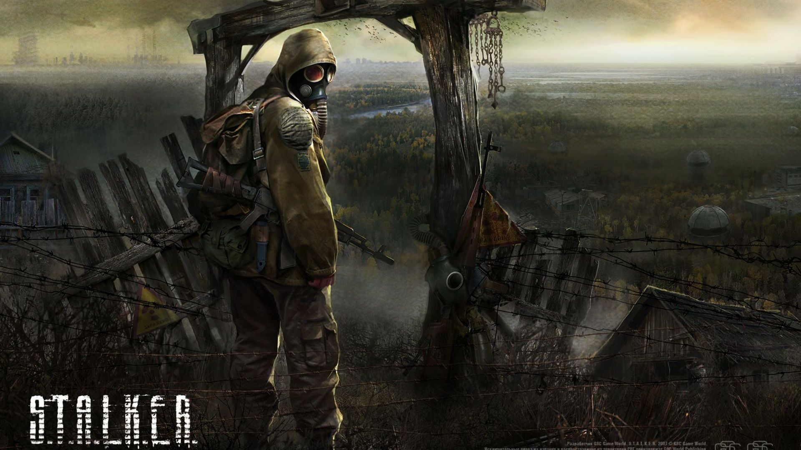
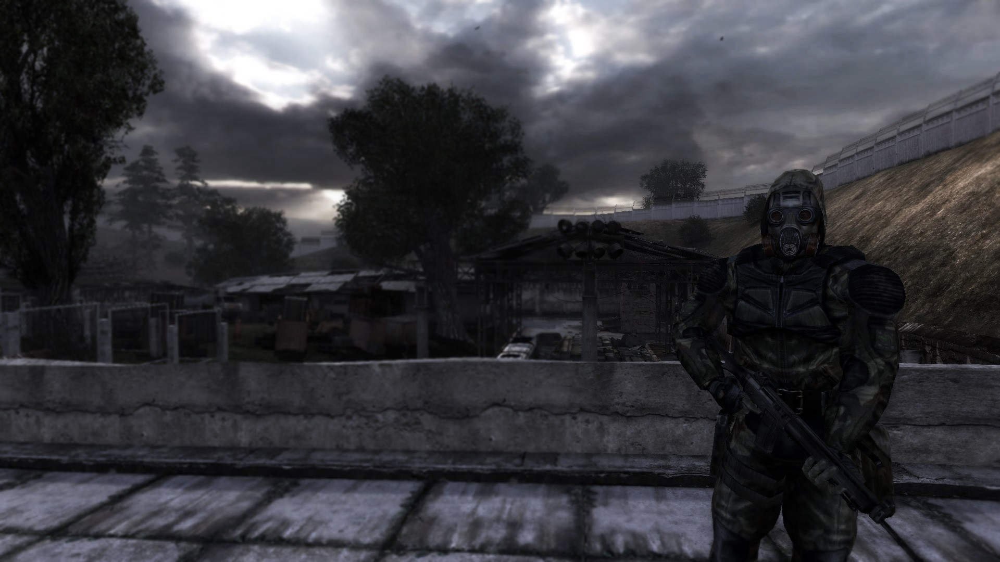

> “Мы будем делать Добро из Зла, потому что его больше не из чего делать.” - Аркадий Стругацкий

The atmosphere of this thing.  It's like nothing I have experienced before in a video game.

<figure>
    
</figure>

Chernobyl, nuclear disasters, radiation, and post apocalyptic wastelands containing a severely dwindled human population have always interested me.  S.T.A.L.K.E.R. encapsulates all of those things.  The dark, ominous, overcast sky that looks like the curse of a deity upon this wicked world, the ravaged trees and wildlife that beget eerie silence, the sense of emptiness and peace that comes attached to the ambience of walking alone among ruins, the fear of an environment and alien lifeforms that are hostile to your existence.  It's all right here.

I was skeptical of S.T.A.L.K.E.R. SOC at first.  It's an older game.  When I booted it up for the first time and saw the low quality cutscene and subsequent awkward dialogue, I wasn't particularly impressed or intrigued to say the least.  But I gave it a chance and it was one of the most rewarding and unique experiences I have had in a game.

S.T.A.L.K.E.R. is an open world, first person shooter.  It wouldn't exactly be classified as an RPG due to its lack of RPG mechanics, but I think it truly is a role-playing game in the basic definition of what that means.  In other words, this game actually makes you feel like a S.T.A.L.K.E.R. living and working amid the devastated environment of the post Chernobyl-NPP disaster.

<figure>
    
</figure>
