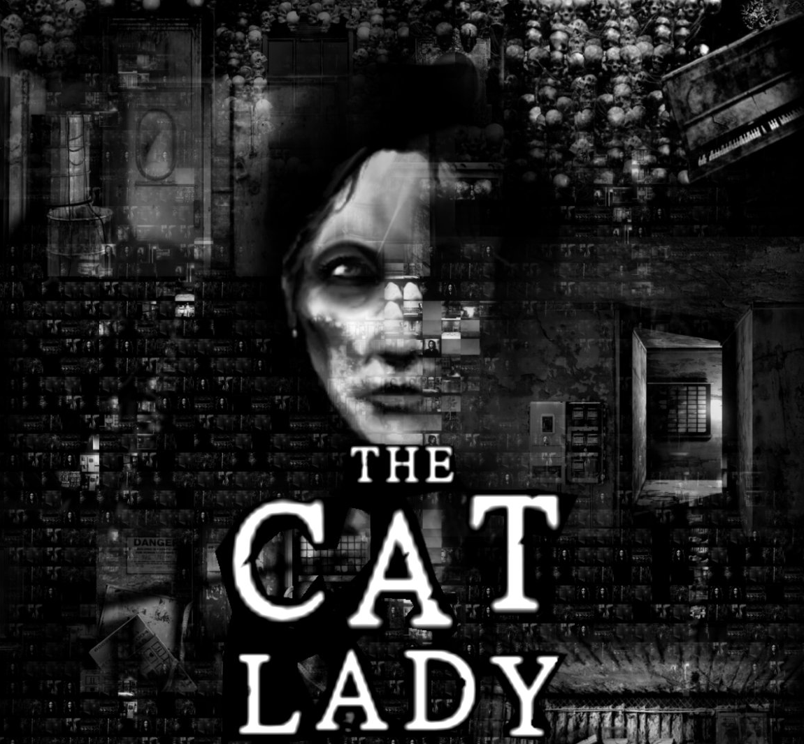

<figure>
    
</figure>

As I reflect back on my life, I see chapters that are characterized by certain emotional paradigms I've inhabited.  Feeling tones, if you will.  Sometimes, they also coincide with some sort of creative work I'm experiencing in the process, or an idea that occupies my mind most of the time.

It often feels like too much of a coincidence that I watch, read, or play something when I need it most.  That was the case for me with this game as well.

---
